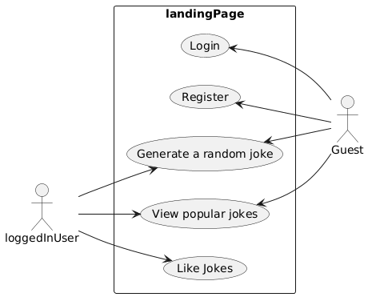

# Rendszerterv

## A rendszer célja

## Üzleti folyamatok modellje

## Követelmények

## Funkcionális terv

## Architekturális terv

Web kliens:
A web alkalmazás a React könyvtár használatával készül el.

## Adatbázis terv

## Implementációs terv

Web:

A webes felület főként HTML, CSS és Javascript nyelven fog készülni. Ezeket a technológiákat amennyire csak lehet külön fájlokba írva készítjük, és úgy fogjuk egymáshoz csatolni a jobb átláthatóság, könnyebb változtathatóság, és könnyebb bővítés érdekében.

## Tesztterv

## Telepítési terv

## Karbantartási terv

Webes alkalmazás:

A szoftver webes felületéhez csak egy ajánlott böngésző telepítése szükséges (Google Chrome, Firefox, Opera, Safari), külön szoftver nem kell hozzá. A webszerverre közvetlenül az internetről
kapcsolódnak rá a kliensek

Karbantartási terv:

Az alkalmazás folyamatos üzemeltetése és karbantartása, mely magában foglalja a programhibák elhárítását, a belső igények változása miatti módosításokat, valamint a környezeti feltételek változása miatt megfogalmazott program-, illetve állomány módosítási igényeket. Ellenőrizni kell, hogy a különböző böngészőkkel kompatibilis-e az alkalmazás. Idő elteltével új, interaktívabb dolgokat kell hozzáadni a weboldalhoz, hogy fent tartsuk az érdeklődési szintet.

Karbantartás:

Corrective Maintenance: 
A felhasználók által felfedezett és "user reportban" elküldött hibák kijavítása.

Adaptive Maintenance: 
A program naprakészen tartása és finomhangolása. Perfective Maintenance: A szoftver hosszútávú használata érdekében végzett módosítások, új funkciók, a szoftver teljesítményének és működési megbízhatóságának javítása.

Preventive Maintenance: 
Olyan problémák elhárítása, amelyek még nem tűnnek fontosnak, de később komoly problémákat okozhatnak.
